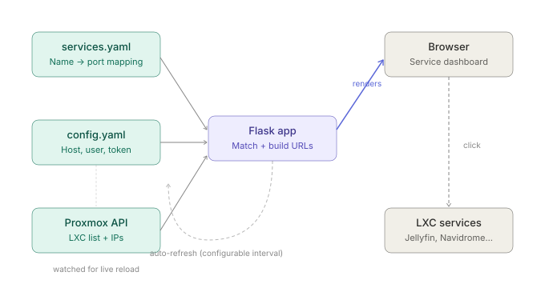
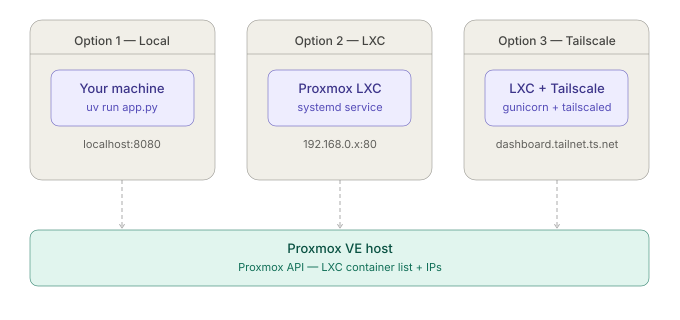
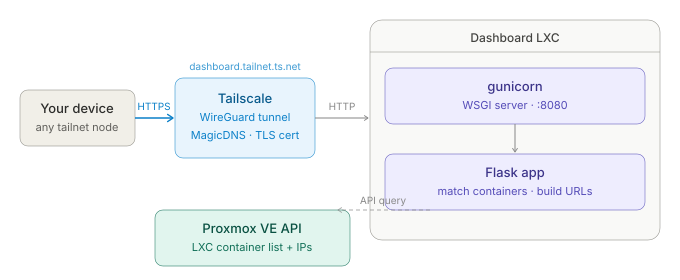

# Proxmox Services Homepage

A dynamic web dashboard for Proxmox VE that displays all running LXC containers and their services as clickable links. Automatically discovers container IPs via the Proxmox API and matches them to service definitions in `services.toml`.


## Features

- **Auto-discovery** — queries the Proxmox API to find running LXC containers and their IPs
- **Service matching** — maps container names to service definitions (port, icon, description)
- **Two views** — a clean card-based service launcher and a detailed container info view, toggled via `/#detailed`
- **Real-time updates** — SSE push from the server the moment the cache refreshes; no polling lag
- **Live config reload** — edit `config.toml` or `services.toml` and changes are picked up without restarting
- **JSON API** — `/api/containers` and `/api/services` endpoints for integration with other tools


## How it works



## Deployment options



## Requirements

- [Bun](https://bun.sh/) v1.0+
- A Proxmox VE instance with API access
- A Proxmox API token with at least `PVEAuditor` role on `/`

## Configuration

### Proxmox API Token

Create a dedicated user and API token in Proxmox:

```bash
# Create user
pveum user add dashboard@pam --comment "Dashboard service"

# Create role with audit permissions
pveum role add DashboardAuditor --privs "VM.Audit Sys.Audit Datastore.Audit"

# Assign role
pveum acl modify / --users dashboard@pam --roles PVEAuditor

# Create API token (save the token secret shown - it won't be shown again)
pveum user token add dashboard@pam dashboard --privsep 0
```

Or reuse an existing token that has `PVEAuditor` on `/`.

### config.toml

Copy the example and fill in your details:

```bash
cp config.toml.example config.toml
chmod 600 config.toml   # restrict access — the file contains your API token
```

`config.toml` is git-ignored so your API token won't be accidentally committed. `config.toml.example` is the committed template.

```toml
[proxmox]
host = "192.168.0.1:8006"     # Proxmox host IP and port
user = "dashboard@pam!token"  # user@realm!tokenname
token = "your-token-secret"   # Token secret from Proxmox
ssl_verify = false             # false = skip verification (default, for self-signed certs)
                               # true  = verify against system CA bundle
                               # "/path/to/ca.pem" = verify against a custom CA cert

[server]
host = "0.0.0.0"
port = 8000                    # Change to 80 for no-port access

[dashboard]
auto_refresh_seconds = 30
title = "Proxmox Container Dashboard"
```

### services.toml

Maps LXC container names to their service information. Containers not listed here will still appear in the detailed view but won't have a service link. Containers without a `port` are skipped in the service view.

```toml
[services.jellyfin]
port = 8096
name = "Jellyfin"
icon = "🎬"
description = "Media Server"

[services.myservice]
port = 8080
name = "My Service"
icon = "🔧"
description = "Description here"
protocol = "https"   # Optional, defaults to http
```

---

## Running the Dashboard

### Option 1 — Local / Development

Run directly on your local machine to access the dashboard from your desktop. Requires network access to your Proxmox host.

```bash
# Clone the repo
git clone https://github.com/pfeerick/proxmox-services-homepage.git
cd proxmox-services-homepage

# Install dev dependencies
bun install

# Configure
cp config.toml.example config.toml
# Edit config.toml with your Proxmox details

# Run (with auto-reload on source changes)
bun run dev
```

Access at `http://localhost:8000` (or whichever port you configured).

---

### Option 2 — Proxmox LXC (LAN access)

Run as a persistent service inside a lightweight Proxmox LXC container. Accessible from anywhere on your LAN without any additional setup.

#### Deploy the LXC

Use the [community-scripts](https://community-scripts.github.io/ProxmoxVE/) Debian script in the Proxmox shell:

```bash
bash -c "$(curl -fsSL https://raw.githubusercontent.com/community-scripts/ProxmoxVE/main/ct/debian.sh)"
```

Use **Advanced** mode to set the hostname (e.g. `dashboard`). Note the assigned IP address.

#### Run the installer

Enter the LXC console and run:

```bash
bash <(curl -fsSL https://raw.githubusercontent.com/pfeerick/proxmox-services-homepage/master/install.sh)
```

The installer will:
- Install `git`, `curl`, and `bun`
- Clone the repo to `/opt/dashboard`
- Prompt for your Proxmox host, API credentials, port, and title
- Write `config.toml` and create/enable the systemd service
- Optionally set up a daily auto-update timer

Access at `http://<lxc-ip>` (port 80) or `http://<lxc-ip>:8000` depending on the port you chose.

> **Updating** — re-run the installer at any time; it detects an existing install and pulls the latest changes instead of cloning.

---

### Option 3 — Proxmox LXC with Tailscale (remote access)

Extends Option 2 to make the dashboard accessible from anywhere via [Tailscale](https://tailscale.com/), using a named URL with automatic HTTPS — no port forwarding or public exposure required.



#### Follow Option 2 first, then:

##### Enable TUN device for the LXC

On the Proxmox host, stop the LXC and edit its config:

```bash
pct stop <vmid>
nano /etc/pve/lxc/<vmid>.conf
```

Add these lines:

```
lxc.cgroup2.devices.allow: c 10:200 rwm
lxc.mount.entry: /dev/net/tun dev/net/tun none bind,create=file
```

Also add nesting support:

```bash
pct set <vmid> --features keyctl=1,nesting=1
pct start <vmid>
```

##### Install and configure Tailscale

Inside the LXC:

```bash
curl -fsSL https://tailscale.com/install.sh | sh
systemctl start tailscaled
tailscale up
```

Authenticate via the URL shown. Once connected, the LXC will appear in your Tailscale admin console as `dashboard` (or whatever hostname you set) and be accessible at:

```
http://dashboard.your-tailnet.ts.net
```

With MagicDNS and HTTPS enabled in your [Tailscale admin console](https://login.tailscale.com/admin/dns), this becomes:

```
https://dashboard.your-tailnet.ts.net
```

No port needed if running on port 80. Accessible from any device on your tailnet — including mobile via the Tailscale app.

---

## API Endpoints

| Endpoint | Description |
|---|---|
| `GET /` | Dashboard (services view); append `#detailed` for container view |
| `GET /api/stream` | SSE stream — pushes `containers` and `services` events on each cache refresh |
| `GET /api/services` | JSON list of running services with URLs |
| `GET /api/containers` | JSON list of all containers with full details |
| `GET /health` | Health check — returns 503 if Proxmox is unreachable |

---

## Adding a New Service

1. Deploy your LXC with a recognisable hostname (e.g. `myapp`)
2. Add an entry to `services.toml`:

```toml
[services.myapp]
port = 3000
name = "My App"
icon = "🚀"
description = "My new service"
```

3. The dashboard will pick it up automatically on the next refresh — no restart needed.
